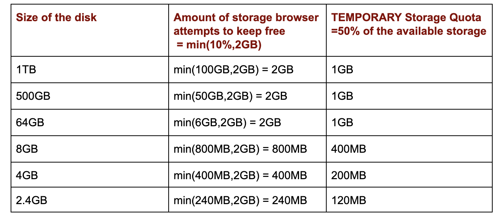

# 如何识别 Chrome 浏览器的隐身模式 

>隐身模式用来防止网站追踪用户。有时，开发者可能希望识别，哪些用户正在使用隐身模式。本文介绍可用的方法

所有现代浏览器都存在隐身或隐私浏览。 此模式可帮助人们避免不需要的cookie，有状态跟踪器。
并且在阅读报纸网站上的文章时也很有用，因为它们中的一些限制用户每天或一定数量的免费文章，
或者只是在隐身模式下打开时阻止访问。

对于其他浏览器系列，这篇文章中的一些内容可能相似或不同，但我只关注基于Chromium的浏览器，更具体地说是Google Chrome。

## 在Chrome 74之前检测隐身窗口

- 在Chrome 74之前，有很多网站利用这个**漏洞**来检测用户是否在Chrome的隐身模式下访问该网站。 网站只需要尝试使用**FileSystem API**，它用于存储临时或永久文件。 此隐私模式下已禁用此API，但该模式存在于非隐身模式中，从而产生了一种差异，可用于检测用户是否使用隐身模式浏览网站并阻止这些用户查看网站的内容。

- 在Google上搜索隐身窗口的简单搜索会产生大量结果，其中一个是Stackoverflow问题，其中让人接受的答案是

```js
var fs = window.RequestFileSystem || window.webkitRequestFileSystem;
if (!fs) {
    console.log("check failed?");
} else {
    fs(window.TEMPORARY,
        100,
        console.log.bind(console, "not in incognito mode"),
        console.log.bind(console, "incognito mode"));
}
```

- 谷歌在Chrome 74中推出了一个新选项（由标志访问：#enable-filesystem-in-incognito），阻止了这种检测。 他们的解决方案是在隐身模式下使用RAM创建虚拟文件系统。 对于上述检测方法，保护工作正常，默认情况下将在下一个稳定版本中启用。

## 自Chrome 74以来检测隐身窗口

事实证明，这种保护是不够的，仍然可以检测隐身模式，从而使电流保护无效。 最近，我正在使用配额管理API，并发现即使启用了此保护也会检测隐身模式的副作用。 此API管理为浏览器上的应用程序和网站提供的TEMPORARY和PERSISTENT存储分配的配额。 可以使用Jeff Posnick的文章中的以下代码片段来查询TEMPORARY存储的配额：
```js
if ('storage' in navigator && 'estimate' in navigator.storage) {
  navigator.storage.estimate().then(({usage, quota}) => {
    console.log(`Using ${usage} out of ${quota} bytes.`);
  });
}
```

网站/应用程序有两种可用的存储，TEMPORARY和PERSISTENT，因为TEMPORARY存储，顾名思义是临时的，它可以在不请求任何配额的情况下使用，并且由浏览器上运行的所有网站共享。

有关TEMPORARY存储及其配额的一些有趣观点，我通过浏览Chromium源代码，文章和错误报告收集了这些内容：（Ref1，Ref2，Ref3）

TEMPORARY存储的默认配额为可用磁盘的50％，作为所有应用程序/网站的共享池
应用程序/网站可以通过调用Quota API的queryUsageAndQuota（）方法来查询其配额，而无需任何权限
隐身窗口的配额是设备内存的一小部分（10％），上限为120MB
非隐身窗口的配额只是设备存储的一小部分

- 下表列出了可用于具有不同磁盘大小的设备的最小TEMPORARY存储配额，该配额是根据浏览器在设备中始终保持空闲的空间量计算得出的

 

- 根据上述观察，隐身和非隐身模式之间临时存储配额的主要区别在于，在隐身模式的情况下，硬限制为120MB，而非隐身窗口的情况则不然。 从上表中可以清楚地看到，对于非隐身模式，临时存储配额小于120MB，设备存储必须小于2.4GB。 但是，出于所有实际目的，可以安全地假设当前使用的大多数设备具有超过2.4GB的存储空间。

使用这些信息，我想出了一个用于检测隐身模式的简单规则，即如果临时存储配额<= 120MB，则可以安全地说它是一个隐身窗口。

```js
if ('storage' in navigator && 'estimate' in navigator.storage) {
	const {usage, quota} = await navigator.storage.estimate();
    console.log(`Using ${usage} out of ${quota} bytes.`);

	if(quota < 120000000){
        console.log('Incognito')
    } else {
        console.log('Not Incognito')
    }	
} else {
	console.log('Can not detect')
}
```
[Bypassing anti-incognito detection in Google Chrome](https://mishravikas.com/articles/2019-07/bypassing-anti-incognito-detection-google-chrome.html)